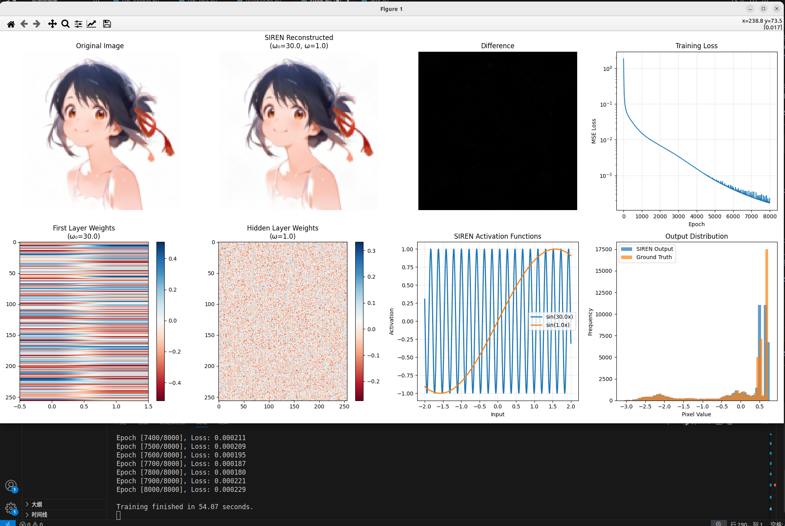

# 关于本项目
本项目是针对msc科研组招新题目的一些实验，主要目的是研究为什么对特征进行编码后，图像重建的性能会有所提升。
## 实验内容
1. 复现原来的实验结果

2. 尝试使用不同的编码器进行特征编码
- 尝试使用高阶多项式进行特征编码
！[lab_polynom.py训练结果](./picture/d3.png)
- 尝试使用高斯核进行特征编码
！[lab_kernel.py训练结果](./picture/d4.png)
- 
### 为什么特征编码后的效果会有所提升？
1. 特征编码可以增加输入特征的维度，从而使得模型能够学习到更复杂的函数映射关系。展开特征编码的数学公式发现，原来的【x,y】坐标被编码成了8维的向量。可以看到使用pos_mlp编码器后，模型的性能提升明显。为了验证这一点，我们可以尝试使用不同的编码方式进行特征编码，同样实现升维，看看是否有更好的效果。
查阅发现，可以加入x,y坐标的高阶组合，使用高阶多项式进行特征编码。(x,y)→(x,y,x2,y2,xy,x3,y3,…)，在lab_polynom.py编写代码并训练。发现经过8000轮训练后，损失函数并没有收敛，其效果如下：

可以看到，模型的性能并没有提升。因此，我们希望寻找为什么使用高阶多项式进行特征编码和使用位置编码同样是对特征进行升维，但效果却不如位置编码。我们需要研究什么样的特征是好学习的，可见维度并不是唯一的影响因素。我们需要进一步研究特征学习的原理，以及如何设计合适的特征映射函数，才能更好地提升模型的性能。
2. 是不是特征维度越高，特征学习的效果越好呢？为了验证这一点，我们可以尝试使用高斯核进行特征编码。设计高斯核函数并取64个高斯核，在lab_kernel.py编写代码并训练。(x,y)→(exp(−(x−μ1)2/2σ2),exp(−(y−μ2)2/2σ2),exp(−(x−μ3)2/2σ2),exp(−(y−μ4)2/2σ2),…)，在gaussian_kernel.py编写代码并训练。发现经过8000轮训练后，损失函数有所下降，其效果如下：
,我们可以发现效果的确是有所提升的，但是并没有达到位置编码的效果。因此，我们需要进一步研究特征学习的原理，以及如何设计合适的特征映射函数，才能更好地提升模型的性能。
3. 查阅资料发现MLP更加容易学习低频的特征信号，了解到：如果一个函数f在空间上随（x,y）变化剧烈，那么它的频率就高；反之，如果f在空间上变化平缓，那么它的频率就低。因此，观察mlp.py训练结果，发现图像重建的模糊主要是因为图像的边缘部分没有被很好地重建出来，而边缘部分正是图像中高频信息集中的地方。因此，我们希望通过特征编码来帮助MLP更好地学习高频信息。位置编码的数学公式可以展开为傅里叶级数的形式，可以看作是对输入坐标进行了一种频率变换，使得MLP能够更容易地学习到高频信息。因此，多项式编码的效果不好的原因也许是因为它并没有很好地帮助MLP学习高频信息，而高斯核编码的效果有所提升也许是因为它在一定程度上帮助MLP学习了一些高频信息。为了验证这个猜想，设计实验lab_RFF.py，使用随机傅里叶特征进行特征编码，并训练。(x,y)→(RFF(x),RFF(y)),在lab_RFF.py编写代码并训练。发现经过8000轮训练后，其效果如下：
,效果并不好，考虑可能是高频特征的数量不足，进行一些优化后再训练。训练效果如下：
,效果有所提升。因此，我们可以得出结论为是高频的特征学习对MLP的性能提升有着更大的帮助。
4. 既然是高频特征学习对MLP的性能提升有着更大的帮助，那么是否可以通过设计更复杂的特征映射函数来提升模型的性能呢？查阅资料发现，可以使用学习型编码的方式来提升模型的性能。学习型编码是一种通过学习来编码输入的特征的编码方式，其原理是通过学习一个编码器来将输入的特征映射到一个低维的空间，然后再将低维的特征映射回输入的空间。学习型编码的优点是可以学习到输入的特征的全局信息，而不仅仅是局部信息。因此，我们可以尝试使用学习型编码的方式来提升模型的性能。在learncode.py编写代码并训练。发现经过8000轮训练后，其效果如下：
,效果有所提升。
5. 既然可以通过对特征编码让输入特征变得能够捕捉高频信息，那么是否可以直接在MLP将激活函数变得更加非线性，从而让MLP能够学习到更多的高频信息呢？查阅资料发现，可以使用SIREN网络来提升模型的性能。SIREN网络是一种通过使用正弦函数作为激活函数的神经网络，其原理是通过使用正弦函数作为激活函数来让神经网络能够学习到更多的高频信息。因此，我们可以尝试使用SIREN网络来提升模型的性能。在siren.py编写代码并训练。发现经过8000轮训练后，其效果如下：
,损失函数收敛速度更快。
6. 综上所述，我们可以得出结论为：
- 特征编码可以增加输入特征的维度，从而使得模型能够学习到更复杂的函数映射关系。
- 图像边缘往往具有高频信息，因此，特征编码可以帮助MLP更好地学习到高频信息。
- 什么样的特征是好学习的？高频，高维的特征学习效果更好，但同时可能难以泛化，导致过拟合，不过图像重建的任务暂时并不需要考虑这一点。